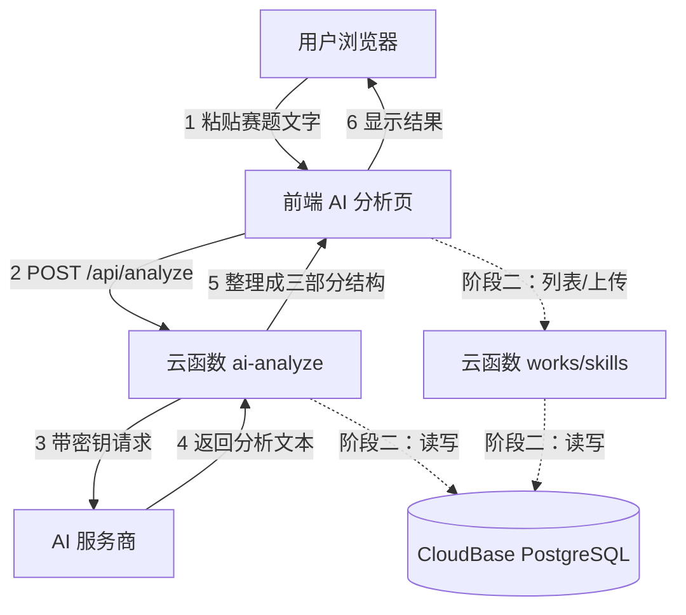

# TECH_DESIGN.md —— 技术设计（Day 5）

> **项目**：magic-hub —— 数学建模 & 电子设计竞赛"保姆式"辅助平台
> **文档日期**：2026-09-20 ｜ **依据文档**：PRD.md（Day 4）、research.md（Day 3）
> **课程位置**：Vibe Coding 五步工作流 · 第 3 步「技术设计」
> **本文档回答**：用什么做（技术路线）、代码怎么摆（项目结构）、数据长什么样（数据模型）、前后端怎么说话（API 与数据流）

---

## 1. 技术路线：三套方案比较与选择

### 1.1 三套候选方案

| 维度 | A 原生静态 + 本地 Node | **B CloudBase 全家桶（选定）** | C Next.js 全栈 |
| --- | --- | --- | --- |
| 前端 | 原生 HTML/CSS/JS 多页 | **React + Vite** | Next.js |
| 后端 | 本机 Node 小服务（Express 类） | **CloudBase Node.js 云函数** | Next.js API 路由 |
| 数据库 | 无（阶段二另找方案） | **CloudBase PostgreSQL** | PostgreSQL |
| 部署 | 需另找静态托管 | **CloudBase 静态网站托管** | 平台托管 |
| Day 7 出 MVP 难度 | 最低 | 中 | 最高 |
| 密钥安全性 | 达标（后端转发） | 达标（云函数环境变量，不进本地） | 达标 |
| 阶段二接数据库 | 最陡：要自己搭服务器与数据库 | **最顺：同平台开通即用** | 较顺 |
| 与课程示范一致度 | 偏 | **完全一致** | 超出课程范围 |

### 1.2 选定路线与理由

**选定路线 B**：React + Vite（前端）→ CloudBase Node.js 云函数（后端）→ CloudBase PostgreSQL（数据库）→ CloudBase 静态网站托管（部署）。

**为什么选它**：

1. **阶段二的"最陡的坡"被平台铲平了**。零基础最容易卡死的一步是"自己搭服务器 + 装数据库"；CloudBase 把这两件事变成"开通即用"，这是 B 相对 A 的决定性优势。
2. **与课程示范同步**，遇到问题能直接对照老师的操作，减少自己摸索的成本。
3. **密钥安全天然达标**：AI 密钥存在云函数的环境变量里，本地代码和前端都接触不到，PRD 的 AC10 更容易满足。

**它的代价（如实记录）**：

1. **零件多**：要同时理解构建工具、云函数、云数据库三样东西，概念密度高于另外两套方案。
2. **依赖平台**：平台规则或免费额度变化会影响项目（额度以官方当日说明为准，**待核实**）。
3. **Day 7（2 天后）出 MVP 有压力** —— 应对见 1.3。

### 1.3 阶段一最小落地顺序（降低 Day 7 风险）

按以下顺序推进，**每一步都能独立验收**，任一步卡住都不影响前一步已交付的成果：

```
第 1 步  静态页面（纯 HTML/CSS）→ 上静态托管，先让网站"能打开"
第 2 步  一个云函数 ai-analyze → 用测试请求验证"能返回 AI 结果"
第 3 步  前端页面调通云函数 → PRD 的 AC7/AC8/AC9 达成
第 4 步  引入 React + Vite 重写页面 → 工程化，为后续功能打底
第 5 步  资料库/资源导航/Skill 页填充内容 → AC4/AC5/AC6/AC11 达成
```

**原则**：第 4 步（引入 React）是**升级而非前提**——若 Day 7 前时间不够，前 3 步已能交付一个可演示的 MVP，React 迁移顺延到 Day 8–22。

---

## 2. 项目结构

```
magic-hub/
├─ index.html              阶段一静态入口（第 4 步后由 Vite 构建产物接管）
├─ src/                    React 源码（第 4 步引入）
│  ├─ main.jsx             入口
│  ├─ App.jsx              路由与总体布局
│  ├─ pages/               页面：首页、数模区、电赛区、资料库、资源导航、AI 分析、Skill 下载
│  ├─ components/          复用组件：分区卡片、资料条目、导航栏、占位提示
│  └─ api/                 调用后端的封装（统一错误处理入口）
├─ cloudfunctions/         云函数（后端）
│  └─ ai-analyze/
│     ├─ index.js          转发 AI 请求、格式化返回
│     └─ package.json      该函数的依赖声明
├─ public/                 静态资源（图标、示意图）
├─ .env.local              本地环境变量（**已被 .gitignore 拦截，绝不进仓库**）
├─ .gitignore
├─ AGENTS.md               规则文件（Day 1）
├─ research.md             需求研究（Day 3）
├─ PRD.md                  产品需求（Day 4）
└─ TECH_DESIGN.md          本文件（Day 5）
```

**两条结构纪律**：

1. **文档留根目录，代码进子目录**。PRD 与 research 是给人和老师看的，放根目录一眼可见；应用代码收敛进 `src/` 与 `cloudfunctions/`，互不混杂。
2. **原 `index.html` 不删**。第 4 步引入 React 后它被构建产物取代，但按 AGENTS.md「不擅自删文件」，是否删除由你决定。

---

## 3. 数据模型

### 3.1 阶段一（静态内容，无数据库）

资料库、资源导航、Skill 三类内容以**静态数据文件**形式存在代码中，字段沿用 PRD 第 6 节定义：

| 内容类型 | 字段（见 PRD 6.1–6.3） |
| --- | --- |
| 资料条目 | title / year / category / zone / summary / link / body |
| 资源导航条目 | name / purpose / url / group / zone |
| Skill 条目 | name / purpose / target / guide / content |

### 3.2 阶段二（CloudBase PostgreSQL，Day 24–28 启用）

| 表 | 字段 | 说明 |
| --- | --- | --- |
| **users** | id (PK)、nickname、email、created_at | 由 CloudBase 登录体系产生，不自建密码逻辑 |
| **works** | id (PK)、user_id (FK)、title、type、zone、file_url、summary、created_at | 用户上传的作品；type = problem / paper / code / drawing |
| **skills** | id (PK)、name、purpose、target、guide、content、author_id (FK)、created_at、download_count | 用户上传的 skill；阶段一的内置 skill 迁入此表 |

**设计说明**：

- `zone` 字段（数模 / 电赛）是双区隔离的数据基础，所有内容表都带它。
- `works.type` 用枚举而非多张表，避免表数量膨胀——28 天课程不做复杂建模。
- 阶段一的静态字段与阶段二表字段**一一对应**（如资料的 title/year/category 都能直接落表），迁移时不需要重新设计。

---

## 4. API 列表

统一约定：请求与响应都用 JSON；响应体固定为 `{ ok, data }` 或 `{ ok:false, code, message }`。

### 4.1 阶段一

| 方法 | 路径 | 作用 | 请求 | 成功返回 |
| --- | --- | --- | --- | --- |
| GET | `/api/health` | 健康检查：服务与 AI 配置是否就绪 | 无 | `{ ok:true, data:{ aiReady: true } }` |
| POST | `/api/analyze` | 赛题分析（转发 AI） | `{ problem_text }` | `{ ok:true, data:{ summary, direction, pitfalls } }` |

**`/api/analyze` 说明**：后端把 `problem_text` 包进固定提示词模板发给 AI，再把返回内容整理成 PRD 3.4 要求的**三部分固定结构**（题目概述 / 解题方向建议 / 坑点提示）。

### 4.2 阶段二（Day 24–28）

| 方法 | 路径 | 作用 |
| --- | --- | --- |
| GET | `/api/works` | 我的作品列表（仅本人可见） |
| POST | `/api/works` | 上传作品（题目 / 论文 / 代码 / 图纸） |
| DELETE | `/api/works/:id` | 删除自己的作品 |
| GET | `/api/skills` | skill 列表 |
| POST | `/api/skills` | 上传自制 skill |
| POST | `/api/analyze-paper` | （尽力项）按分析结果生成论文内容 |

**说明**：登录**不自建**——直接用 CloudBase 提供的登录能力，避免自己实现密码存储（安全风险高、课程也不覆盖）。

---

## 5. 前后端数据流

> 本节含数据流图（Mermaid 真图 + ASCII 兜底图），见下方 5.1–5.3。

### 5.1 数据流图（Mermaid，GitHub 可渲染）



### 5.2 数据流图（ASCII 兜底版，本地打开也可读）

```
   用户浏览器
       │  ① 粘贴赛题文字
       ▼
   前端页面（AI 分析页）
       │  ② POST /api/analyze  { problem_text }
       ▼
   云函数 ai-analyze ──── ③ 带密钥请求 ────►  AI 服务商
       │                                        │
       │  ⑤ 整理成：题目概述/解题方向/坑点提示  ④ 返回文本
       ▼                                        │
   前端页面 ◄──────────────────────────────────┘
       │  ⑥ 渲染显示
       ▼
   用户看到结果
```

### 5.3 数据从哪来、到哪去（一句话版）

- **来**：赛题文字来自**用户手动粘贴**（阶段二后，用户上传的论文／代码／图纸也来自用户）。
- **经**：全部经过**云函数**这一道门——密钥在这里，校验也在这里。
- **去**：分析结果**直接回给当前页面**（阶段一不落库）；用户上传的内容**落进 PostgreSQL**，只有本人可见。

---

## 6. 错误处理

### 6.1 后端错误码约定

| code | 含义 | 前端显示 |
| --- | --- | --- |
| `INVALID_INPUT` | 输入为空或格式不对 | "请先粘贴赛题内容" |
| `TOO_LONG` | 超过 5000 字上限（PRD 6.4） | "内容过长，请精简后重试" |
| `RATE_LIMIT` | 请求过于频繁 | "操作太快了，请稍后再试" |
| `UPSTREAM_ERROR` | AI 服务商返回错误 | "分析暂时不可用，请稍后重试" |
| `TIMEOUT` | 超时（含 AI 响应超时） | "分析超时，请重试" |
| `INTERNAL` | 其他未预期错误 | "服务开小差了，请重试" |

**原则**：技术细节（堆栈、供应商原始报错）**只写进后端日志**，绝不返回给浏览器——对应 PRD AC9。

### 6.2 前端错误处理规则

1. 所有请求走 `src/api/` 里的统一封装，集中处理超时、重试与提示，页面不各写一套。
2. 失败提示固定附带「重试」按钮（PRD 5.3）。
3. 加载中按钮禁用，防止重复提交（PRD 5.3）。
4. 任何异常都不允许出现白屏——按 PRD 第 7 节给出可读提示。

---

## 7. 环境变量

### 7.1 变量清单

| 变量 | 存放位置 | 用途 | 是否进仓库 |
| --- | --- | --- | --- |
| `AI_API_KEY` | **云函数环境变量**（云端配置） | 调用 AI 服务的密钥 | **绝不** |
| `AI_BASE_URL` | 云函数环境变量 | AI 服务地址（换供应商只改这里） | 否 |
| `AI_MODEL` | 云函数环境变量 | 模型名（换模型只改这里） | 否 |
| `AI_TIMEOUT_MS` | 云函数环境变量 | 超时阈值 | 否 |
| `VITE_API_BASE` | `.env.local`（本地） | 前端请求后端的基础地址 | 否 |

### 7.2 三条安全纪律

1. **前端不出现任何密钥**——所有密钥只在云函数环境变量里（PRD AC10）。
2. **`.env` 系列文件永不进仓库**——`.gitignore` 自 Day 2 起已拦截；**Day 5 已实测复核**：`.env`、`.env.*`、`.env.local`、`*.env` 四个写法全部覆盖（`.gitignore` 第 19–26 行），无需补充规则。
3. **本地开发用 `.env.local`，云端用平台的环境变量配置界面**，两边内容一致、都不进代码。

---

## 8. 迁移注意事项

| 迁移 | 何时 | 注意什么 |
| --- | --- | --- |
| 静态页 → React/Vite | 阶段一第 4 步 | 原 `index.html` 保留不删；页面逐一迁移、逐个对照 PRD 验收标准回归 |
| 本地开发 → 云端部署 | 静态页完成后 | 前端打包产物上传静态托管；云函数单独部署；**部署前确认环境变量已在云端配好** |
| 静态内容 → PostgreSQL | Day 24–28 | 字段按 3.2 对齐（阶段一字段已一一对应）；先建表再灌数据；**迁移前备份现有静态数据文件** |
| 换 AI 供应商 | 任意时刻 | 只改 `AI_BASE_URL` / `AI_MODEL` / `AI_API_KEY` 三个变量（research.md 4.3 的"可切换网关"设计） |
| 加新页面 | 持续 | 页面必须挂上顶部导航，且满足"2 次点击回首页"（PRD AC2）；占位页必须带"建设中"标注（PRD AC12） |

**通用纪律**：每次迁移都单独提交一次，commit 信息写明迁移内容，出问题可用 `git revert` 整体回退。

---

## 9. 待确认事项（信息不足，标为假设）

| # | 事项 | 当前临时假设 | 何时必须确认 |
| --- | --- | --- | --- |
| 1 | CloudBase 账号与具体产品形态 | 按课程示范使用 CloudBase（云函数 + PostgreSQL + 静态托管） | 开通那天（Day 23 前） |
| 2 | AI 服务商与 API key | **尚未申请**；文档按"可切换网关"设计，不绑定供应商 | Day 6–7 之前 |
| 3 | 是否已备域名 | 假设无域名，先用平台默认域名 | 上线前 |
| 4 | CloudBase 免费额度与计费 | 未核实，按官方当日说明为准 | 开通那天 |
| 5 | CloudBase 是否原生提供 PostgreSQL 及连接方式 | 按课程示范假定提供；**接入当天以官方文档为准，不凭记忆操作** | Day 23–24 |

---

## 变更记录

| 日期 | 变更 |
| --- | --- |
| 2026-09-20 | Day 5 首版：三套方案比较与选定路线 B（含理由与代价）、阶段一最小落地顺序、项目结构、数据模型、API 列表、数据流图（Mermaid + ASCII）、错误处理、环境变量、迁移注意事项、待确认事项 5 条 |
| 2026-09-20 | 实测复核：`.gitignore` 已覆盖 `.env.local`（第 19–26 行四个写法全中），环境变量一条由「待核实」改为「已确认」 |
